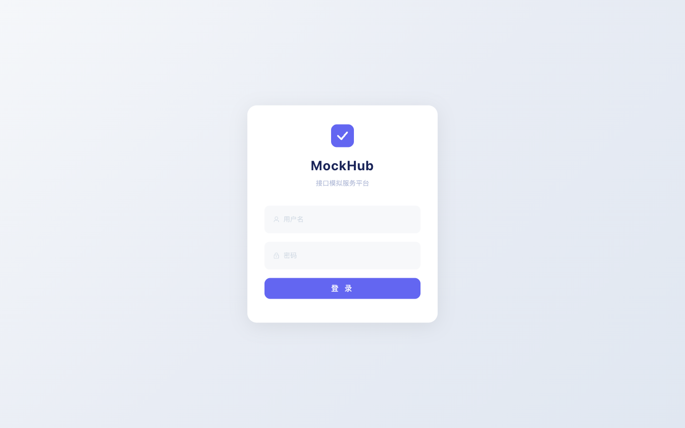
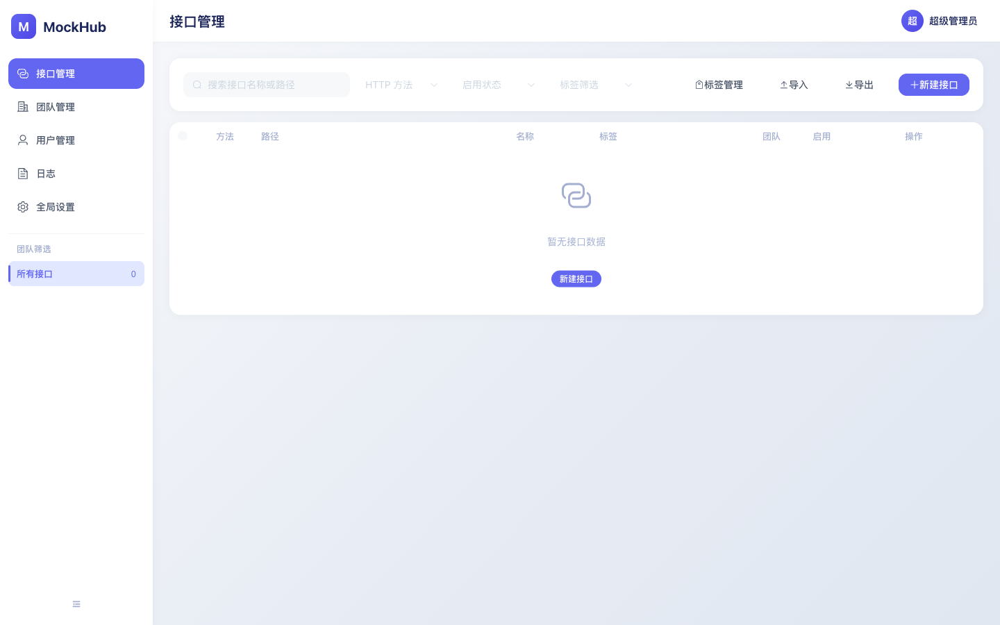
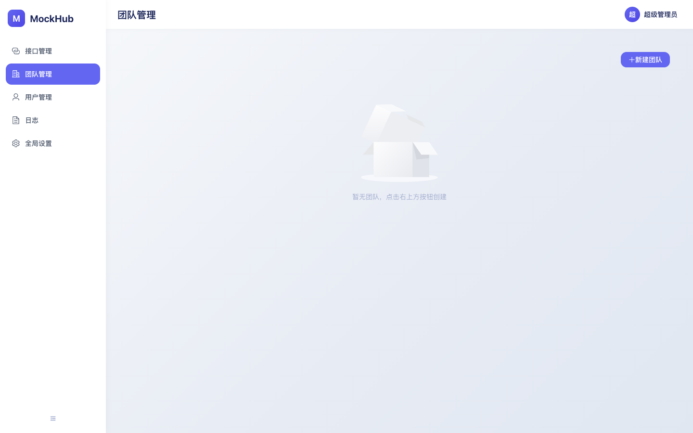
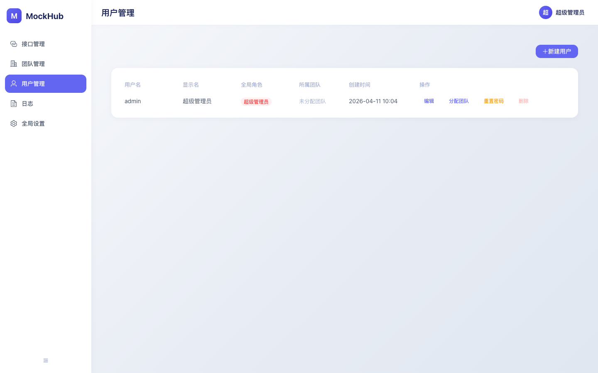
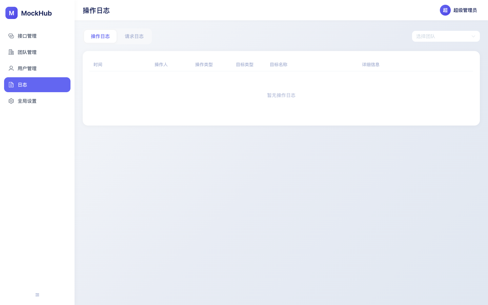
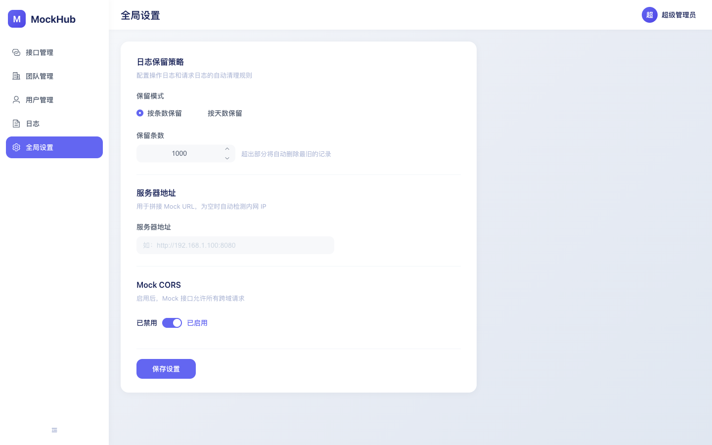
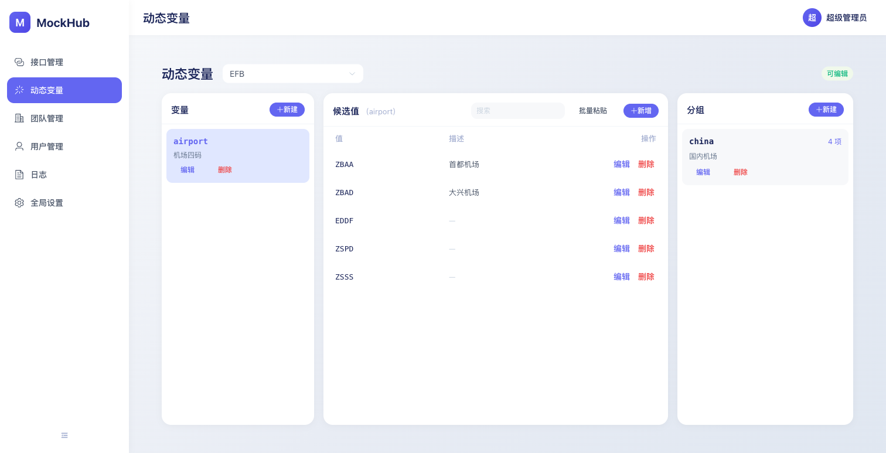

# MockHub

[](LICENSE)
[](https://www.oracle.com/java/technologies/javase/javase8-archive-downloads.html)
[](https://spring.io/projects/spring-boot)
[](https://vuejs.org/)

内网接口模拟服务，支持 REST 和 SOAP 接口 Mock，提供现代化 Web 管理界面。

**单个 jar 文件即可运行，零外部依赖，专为离线内网环境设计。**

---

## 功能截图

| 登录 | 接口管理 |
|:---:|:---:|
|  |  |

| 团队管理 | 用户管理 |
|:---:|:---:|
|  |  |

| 日志 | 全局设置 |
|:---:|:---:|
|  |  |

| 动态变量 |
|:---:|
|  |

---

## 功能特性

### 已实现

- [x] **REST Mock** -- 支持 GET / POST / PUT / DELETE / PATCH，自定义状态码、响应头、响应体
- [x] **SOAP Mock** -- 上传 WSDL 自动解析 Operation，独立配置每个操作的返回 XML
- [x] **团队隔离** -- 多团队独立管理接口，Mock 路径按团队标识隔离，互不干扰
- [x] **路径参数** -- 支持 `/api/user/{id}` 风格路径匹配，响应体中通过 `{{path.id}}` 引用参数值
- [x] **动态变量** -- 内置 `{{timestamp}}`、`{{uuid}}`、`{{date}}`、`{{datetime}}`、`{{random_int}}`；编辑器提供「插入变量」按钮和 `{{` 智能补全
- [x] **自定义动态变量** -- 团队级维护命名值集合，支持按分组组织；响应体 `{{pet}}` 从全部值随机挑、`{{pet.mammal}}` 从指定分组随机挑；解析失败 fail-fast 返回统一错误格式
- [x] **多返回体** -- 单个接口可配置多个响应体，支持切换活跃返回体
- [x] **接口描述** -- 支持富文本描述接口用途和说明
- [x] **Monaco Editor** -- 内置代码编辑器，JSON / XML / 纯文本语法高亮和格式化
- [x] **大文本支持** -- 响应体支持 5~6 MB 大文本
- [x] **WSDL 托管** -- 上传的 WSDL 文件可通过 `/wsdl/{fileName}` 直接访问，`soap:address` 自动替换为实际地址
- [x] **全局响应头** -- 团队级别的公共响应头，接口级别可覆盖
- [x] **导入导出** -- 按团队导出接口定义（含标签），支持合并或覆盖两种导入模式
- [x] **操作日志 / 请求日志** -- 记录管理操作和 Mock 请求，支持按条数或天数自动清理
- [x] **权限控制** -- 超级管理员 / 团队管理员 / 普通成员 三级权限
- [x] **用户管理** -- 密码修改、超管重置密码
- [x] **CORS 支持** -- Mock 接口默认允许跨域，可通过参数关闭
- [x] **SQLite 存储** -- 嵌入式单文件数据库，无需安装，易于备份

### 计划中 (Roadmap)

- [ ] **多场景响应** -- 根据请求参数 / Body 匹配不同响应（条件路由）
- [ ] **响应延迟** -- 模拟接口耗时，支持固定延迟和随机延迟区间
- [ ] **请求校验** -- 校验请求参数是否符合预期格式，不匹配时返回自定义错误
- [ ] **接口文档生成** -- 基于 Mock 定义自动生成简易接口文档
- [ ] **Swagger / OpenAPI 导入** -- 从 Swagger JSON/YAML 一键导入接口定义
- [ ] **Postman Collection 导入** -- 从 Postman 导出文件导入

> 欢迎提交 [Issue](../../issues) 反馈需求或 Bug！

---

## 环境要求

- **Java 8** 或更高版本（推荐 Java 8，已严格兼容）
- Windows / Linux / macOS 均可运行

---

## 快速开始

### 1. 下载

从 [Release](../../releases) 页面下载最新版本的压缩包，解压即可使用。

压缩包内包含：

```
mockhub-x.x.x/
├── mockhub-x.x.x.jar    # 可执行文件
├── mockhub.sh            # Linux / macOS 管理脚本
└── mockhub.bat           # Windows 管理脚本
```

### 2. 运行

**直接运行：**

```bash
java -jar mockhub-x.x.x.jar
```

**使用管理脚本：**

```bash
# Linux / macOS
chmod +x mockhub.sh
./mockhub.sh start

# Windows
mockhub.bat start
```

管理脚本支持 `start`、`stop`、`restart`、`status` 命令，无参数时显示交互菜单。

首次启动会自动创建 `data/` 目录和 SQLite 数据库，并初始化默认管理员账号。

### 3. 访问

浏览器打开 `http://localhost:8080`，使用默认账号登录：

- 用户名：`admin`
- 密码：`admin123`

> 首次登录会强制要求修改密码。

### 4. 使用 Mock

创建接口后，Mock 地址格式为：

```
http://{host}:{port}/mock/{teamIdentifier}/your/api/path
```

例如团队标识为 `FE`，配置了 `GET /api/user/info`，则 Mock 地址为：

```
GET http://localhost:8080/mock/FE/api/user/info
```

---

## 启动参数

| 参数 | 默认值 | 说明 |
|------|--------|------|
| `--server.port` | `8080` | 服务端口 |
| `--data.path` | `./data` | 数据目录路径（SQLite 数据库、WSDL 文件） |
| `--log.retain.mode` | `count` | 日志保留模式：`count`（按条数）或 `days`（按天数） |
| `--log.retain.count` | `1000` | `count` 模式下保留的最大条数 |
| `--log.retain.days` | `30` | `days` 模式下保留的天数 |
| `--mock.cors.enabled` | `true` | Mock 接口是否允许跨域 |

示例：

```bash
java -jar mockhub-1.4.2.jar \
  --server.port=9090 \
  --data.path=D:/mockhub/data \
  --log.retain.mode=days \
  --log.retain.days=7
```

---

## 开发者指南

### 技术栈

| 层 | 技术 |
|----|------|
| 后端 | Java 8 + Spring Boot 2.7.x + Spring Security + Apache CXF 3.x |
| 数据库 | SQLite（嵌入式，WAL 模式） |
| 前端 | Vue 3 + Vite + Element Plus + Monaco Editor |
| 认证 | JWT（启动时随机密钥，重启后旧 Token 自动失效） |

### 本地开发

```bash
# 启动后端（项目根目录）
mvn spring-boot:run

# 启动前端（另开终端）
cd frontend
npm install
npm run dev
```

前端开发服务器默认运行在 `http://localhost:5173`，API 请求会代理到后端 `http://localhost:8080`。

### 生产构建

```bash
# 1. 构建前端（产物输出到 src/main/resources/static）
cd frontend
npm run build

# 2. 打包 fat jar
cd ..
mvn clean package -DskipTests
```

构建产物：`target/mockhub-{version}.jar`

---

## 注册为 Windows 服务

使用 [WinSW](https://github.com/winsw/winsw) 可将 MockHub 注册为 Windows 服务，实现开机自启动。

1. 下载 `WinSW-x64.exe`，重命名为 `mockhub-service.exe`，放到 jar 同级目录

2. 在同级目录创建 `mockhub-service.xml`：

```xml
<service>
  <id>MockHub</id>
  <name>MockHub</name>
  <description>MockHub 接口模拟服务</description>
  <executable>java</executable>
  <arguments>-jar mockhub-1.4.2.jar --server.port=8080 --data.path=./data</arguments>
  <workingdirectory>%BASE%</workingdirectory>
  <logpath>%BASE%\logs</logpath>
  <log mode="roll-by-size">
    <sizeThreshold>10240</sizeThreshold>
    <keepFiles>3</keepFiles>
  </log>
</service>
```

3. 以管理员身份运行：

```bash
mockhub-service.exe install   # 安装服务
mockhub-service.exe start     # 启动服务
mockhub-service.exe status    # 查看状态
mockhub-service.exe stop      # 停止服务
mockhub-service.exe uninstall # 卸载服务
```

---

## 数据备份

所有数据存储在 `data/` 目录下，定期备份该目录即可：

- `mockhub.db` -- 全部业务数据（用户、团队、接口定义、日志等）
- `wsdl/` -- 上传的 WSDL 文件

> 建议在服务停止时备份，或利用 SQLite 的 WAL 模式特性在运行时安全复制。

---

## 开源协议

[MIT License](LICENSE)
