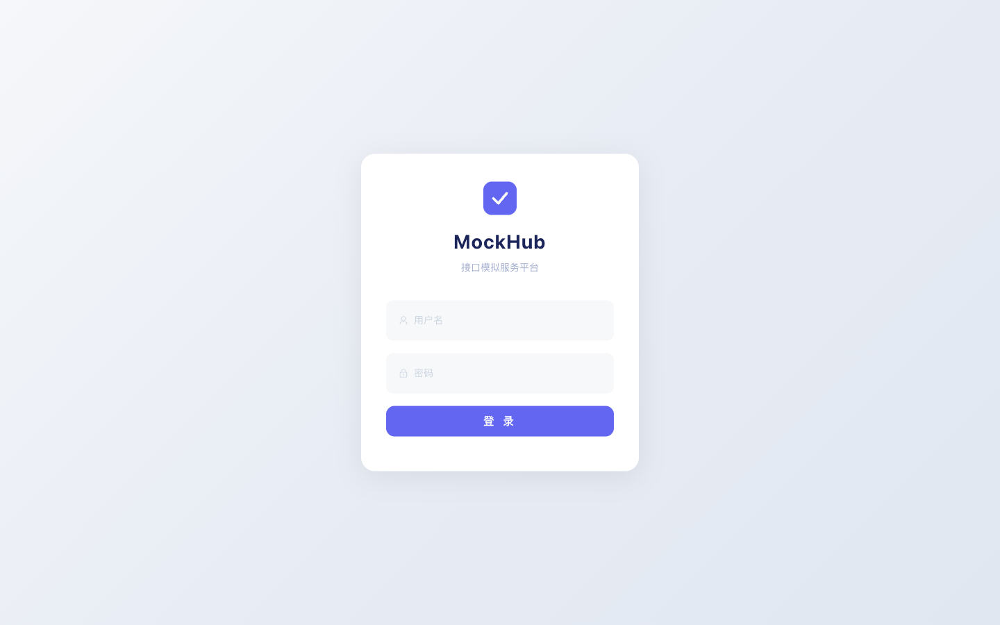
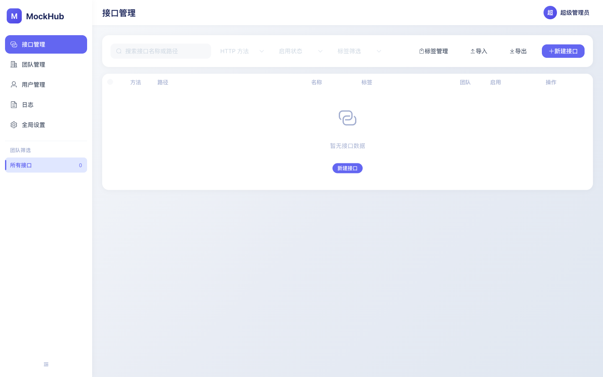
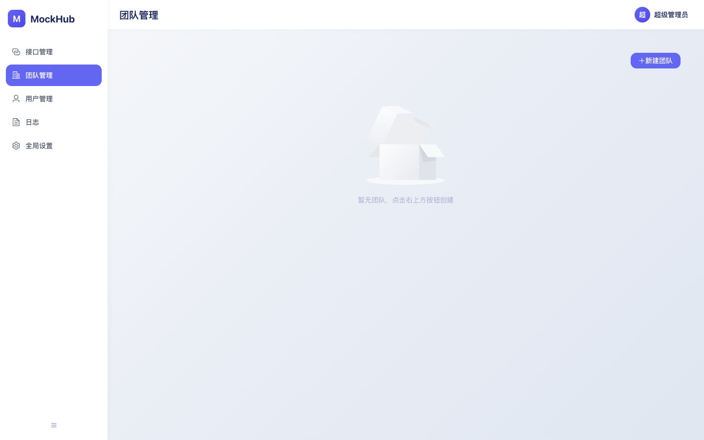
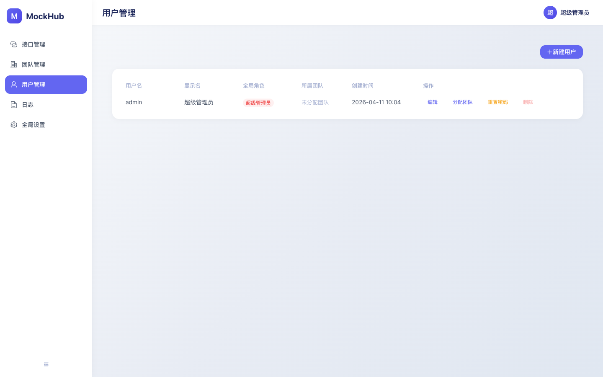
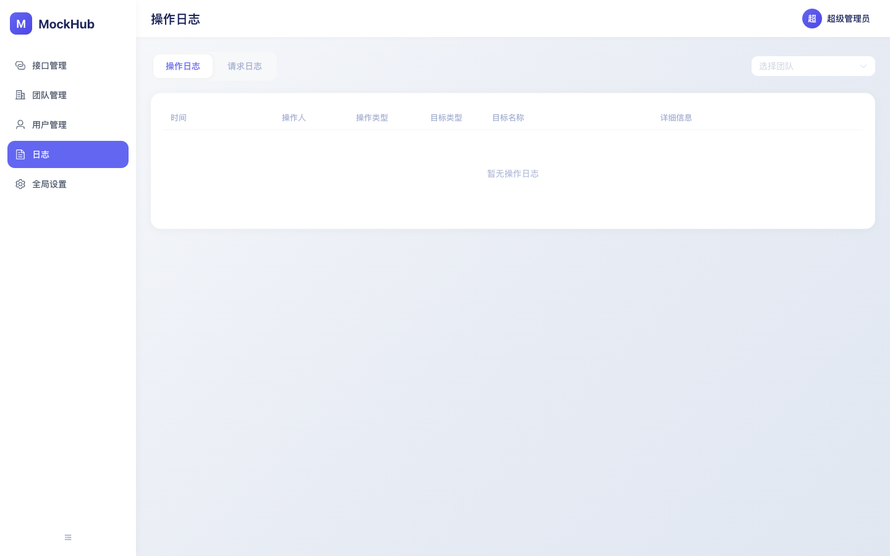
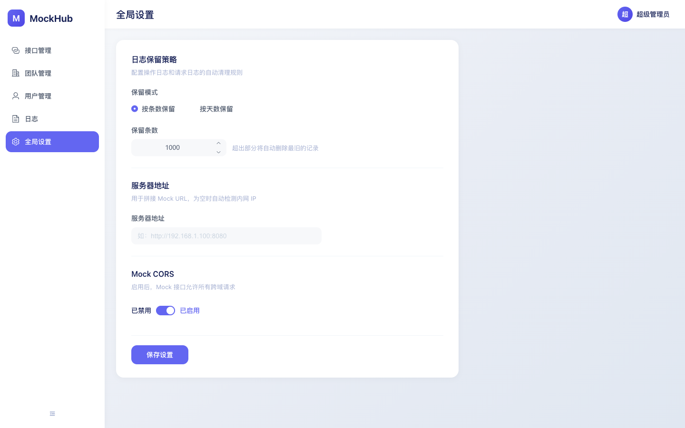
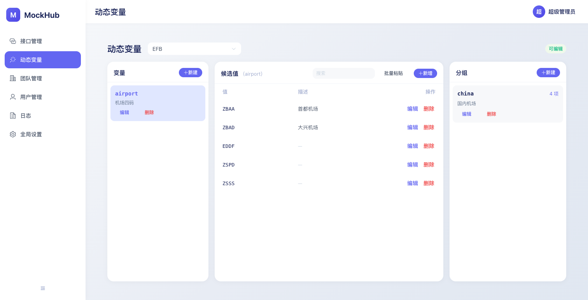

# MockHub

[](LICENSE)
[](https://www.oracle.com/java/technologies/javase/javase8-archive-downloads.html)
[](https://spring.io/projects/spring-boot)
[](https://vuejs.org/)

内网接口模拟服务，支持 REST 和 SOAP 接口 Mock，提供现代化 Web 管理界面。

**单个 jar 文件即可运行，零外部依赖，专为离线内网环境设计。**

---

## 功能截图

| 登录 | 接口管理 |
|:---:|:---:|
|  |  |

| 团队管理 | 用户管理 |
|:---:|:---:|
|  |  |

| 日志 | 全局设置 |
|:---:|:---:|
|  |  |

| 动态变量 |
|:---:|
|  |

---

## 功能特性

### 已实现

- [x] **REST Mock** -- 支持 GET / POST / PUT / DELETE / PATCH，自定义状态码、响应头、响应体
- [x] **SOAP Mock** -- 上传 WSDL 自动解析 Operation，每个 Operation 可独立配置多个返回体、条件规则和兜底响应
- [x] **团队隔离** -- 多团队独立管理接口，Mock 路径按团队标识隔离，互不干扰
- [x] **接口分组** -- 团队下可按业务维度建分组管理接口，支持拖拽排序，列表按分组筛选
- [x] **路径参数** -- 支持 `/api/user/{id}` 风格路径匹配，响应体中通过 `{{path.id}}` 引用参数值
- [x] **动态变量** -- 内置 `{{timestamp}}`、`{{uuid}}`、`{{date}}`、`{{datetime}}`、`{{random_int}}`；编辑器提供「插入变量」按钮和 `{{` 智能补全
- [x] **自定义动态变量** -- 团队级维护命名值集合，支持按分组组织；响应体 `{{pet}}` 从全部值随机挑、`{{pet.mammal}}` 从指定分组随机挑；解析失败 fail-fast 返回统一错误格式
- [x] **多返回体** -- 单个接口可配置多个响应体，支持切换活跃返回体
- [x] **多场景响应** -- 多个返回体可配置匹配条件（Query / JSON Body / SOAP XML Body），命中即返回，未命中走无规则兜底
- [x] **随机返回** -- REST 接口及每个 SOAP Operation 可独立选择等概率随机模式，仅从启用的返回体中选择，无需配置条件与兜底
- [x] **文件服务器模拟** -- 免登录上传、固定 fileId 下载链接、Range 续传，以及按团队管理、检索、标签、统计、预览和批量删除
- [x] **接口描述** -- 支持富文本描述接口用途和说明
- [x] **Monaco Editor** -- 内置代码编辑器，JSON / XML / 纯文本语法高亮和格式化
- [x] **大文本支持** -- 响应体支持 5~6 MB 大文本
- [x] **WSDL 托管** -- 上传的 WSDL 文件可通过 Mock 地址 `?wsdl` 访问，`soap:address` 自动替换为实际地址
- [x] **全局响应头** -- 团队级别的公共响应头，接口级别可覆盖
- [x] **导入导出** -- 按团队导出接口定义（含标签），支持合并或覆盖两种导入模式
- [x] **操作日志 / 请求日志** -- 记录管理操作和 Mock 请求，支持按条数或天数自动清理
- [x] **权限控制** -- 超级管理员 / 团队管理员 / 普通成员 三级权限
- [x] **用户管理** -- 密码修改、超管重置密码
- [x] **CORS 支持** -- Mock 接口默认允许跨域，可通过参数关闭
- [x] **SQLite 存储** -- 嵌入式单文件数据库，无需安装，易于备份
- [x] **接口调用统计** -- 列表展示每个接口的命中次数和最近一次调用时间，识别僵尸 Mock 便于清理

### 使用体验

- [x] **批量操作** -- 列表多选后批量启用 / 禁用 / 删除 / 移动到分组，跨页选择保留
- [x] **自定义排序** -- 表头点击按修改时间 / 名称 / 路径升降序，状态持久化
- [x] **固定操作列** -- 启用开关与操作按钮固定右侧，横向滚动也始终可见
- [x] **侧边栏折叠** -- 顶栏左上角一键折叠 / 展开侧边栏，让出更多列表空间
- [x] **路径冲突预检** -- 编辑路径时实时校验，命中已存在接口立刻在输入框旁报警，避免提交后才报错
- [x] **未保存提示** -- 编辑页有未保存修改时关闭 / 切走 / 刷新均会拦截，二次确认后离开
- [x] **禁用状态可视化** -- 列表中禁用接口整行降透明度，hover 时恢复

### 计划中 (Roadmap)

- [ ] **Swagger / OpenAPI 导入** -- 从 Swagger JSON/YAML 一键导入接口定义，把"批量创建 Mock"的成本从 N 分钟压到 0 秒
- [ ] **复制为 curl** -- 列表行一键复制 curl 命令，前后端联调对齐请求零摩擦
- [ ] **AI 辅助模块（可选）** -- 配置自定义 LLM 接入后启用，不影响离线使用：
    - cURL 命令一键转换为接口定义
    - 根据接口 path/method 自动生成响应体示例
    - WSDL Operation 的智能注释
    - 自然语言描述自动转换为多场景匹配条件

> 欢迎提交 [Issue](../../issues) 反馈需求或 Bug！

---

## 环境要求

- **Java 8** 或更高版本（推荐 Java 8，已严格兼容）
- Windows / Linux / macOS 均可运行

---

## 快速开始

### 1. 下载

从 [Release](../../releases) 页面下载最新版本的压缩包，解压即可使用。

压缩包内包含：

```
mockhub-x.x.x/
├── mockhub-x.x.x.jar    # 可执行文件
├── mockhub.sh            # Linux / macOS 管理脚本
└── mockhub.bat           # Windows 管理脚本
```

### 2. 运行

**直接运行：**

```bash
java -jar mockhub-x.x.x.jar
```

**使用管理脚本：**

```bash
# Linux / macOS
chmod +x mockhub.sh
./mockhub.sh start

# Windows
mockhub.bat start
```

管理脚本支持 `start`、`stop`、`restart`、`status` 命令，无参数时显示交互菜单。

首次启动会自动创建 `data/` 目录和 SQLite 数据库，并初始化默认管理员账号。

### 3. 访问

浏览器打开 `http://localhost:18080`，使用默认账号登录：

- 用户名：`admin`
- 密码：`admin123`

> 首次登录会强制要求修改密码。

### 4. 使用 Mock

创建接口后，Mock 地址格式为：

```
http://{host}:{port}/mock/{teamIdentifier}/your/api/path
```

例如团队标识为 `FE`，配置了 `GET /api/user/info`，则 Mock 地址为：

```
GET http://localhost:18080/mock/FE/api/user/info
```

SOAP 接口上传 WSDL 后，每个 Operation 可独立配置多个返回体。启用多个返回体时，带规则的返回体会按顺序匹配请求，未命中时返回无规则兜底返回体；SOAP Body 条件支持按 XML 元素路径匹配，例如：

```
GetUserRequest.userId == u-1001
```

在 SOAP 返回体的响应规则中选择 Body，点击“粘贴示例”导入 XML，即可搜索字段并点击生成条件。自动生成的路径包含根元素并忽略命名空间前缀，如 `Envelope.Body.GetUserRequest.userId`，沿用现有 `BODY` 条件格式。规则保存后可重新编辑；Query 条件仍可与 Body 条件组合使用。

XML 示例树目前只生成元素文本条件，不生成属性或同名兄弟元素的索引条件；遇到同名兄弟元素、元素名含点号、DOCTYPE 或 XML 格式错误时会提示原因，不导入有歧义的路径。

WSDL 托管地址为：

```
GET http://localhost:18080/mock/FE/soap/user-service?wsdl
```

---

## 文件服务器与随机返回

### 文件服务器模拟

登录后进入侧栏“文件服务器”，可上传文件、按 fileId/文件名/别名检索、按标签筛选、修改别名与标签、查看详情或批量删除。文件归属团队：成员可浏览和上传，团队管理员与超级管理员可修改和删除。

测试程序无需登录，按已存在的团队标识上传：

```bash
curl -F 'file=@./example.pdf' http://localhost:18080/file-server/FE/upload
```

成功响应仍使用 `{code:0,msg:"success",data:{...}}`，`data` 包含 `fileId`、`downloadUrl`、`fileName`、`size`、`uploadedAt` 等字段。下载路径固定为 `/files/{fileId}`，改别名/标签不会改变链接。默认持链接即可下载；匿名上传仅用于可信内网模拟环境。

```bash
# 下载或从本地已有长度续传
curl -C - -o example.pdf http://localhost:18080/files/返回的fileId
# 指定单段字节范围
curl -H 'Range: bytes=0-1023' http://localhost:18080/files/返回的fileId
```

支持 `GET/HEAD`、单段 Range（206/416）、ETag、Last-Modified、If-Range 和条件请求；多段 Range 忽略并返回完整 200。删除后新请求立即返回 404，已经开始的传输可能继续完成。物理文件因占用删除失败时会后台重试。

下载次数按实际开始写出内容的公开 GET 请求累计，续传的每次分段请求分别计数；传输量按应用成功写入响应流的内容字节累计，不等同客户端已收到字节数。HEAD、304、404、416 和文本/Office 管理预览不计数；通过下载流进行的 PDF/音视频/图片预览会计数。

支持 TXT/日志/JSON/XML/HTML、Excel（xls/xlsx）、Word（doc/docx）基础内容预览，PDF/图片/音视频使用浏览器原生能力（具体编码受浏览器支持限制）。HTML 使用 sandbox 与 CSP 禁止脚本和外链资源，SVG 显示源码。Office 预览不是完整排版还原；最多 20MB、Excel 前 10 个工作表/200 行/50 列、总文本 20 万字符，超限提示截断或下载。普通文本超过 2MB 时建议下载。

管理接口均需要登录：`GET /api/files`、`POST /api/files/upload?teamId=...`、`GET/PUT/DELETE /api/files/{fileId}`、`GET /api/files/{fileId}/preview`、`POST /api/files/batch-delete`（请求体 `{"fileIds":["..."]}`）。元数据更新请求体为 `{"alias":"别名","tags":["标签"]}`。

文件存储在 `data.path/file-server`，元数据在同一 SQLite 数据库的新表中，独立于已有 Mock 响应文件及其孤儿清理。备份时应同时保存数据库和文件目录。有文件的团队需先清理文件再删除团队。

默认文件上传上限 100MB。`file-server.max-size-bytes` 与 `spring.servlet.multipart.max-file-size/max-request-size` 应配套调整；既有 Mock 响应文件仍受自身 10MB 服务限制。反向代理部署可设置 `--file-server.public-base-url=https://host/前缀` 生成外部可访问链接，并同步配置代理上传大小与超时。公开文件接口的跨域开关沿用 `mock.cors.enabled`。

### 多返回体的随机模式

在返回体面板选择“等概率随机”：无需条件或默认兜底，每次从当前 REST 接口或 SOAP Operation 的启用响应中随机选择一个；单个启用响应始终返回该项。已配置条件保留但不参与随机选择，切回“条件匹配”后恢复原校验。随机不保证轮流出现或少量请求中次数相同。

随机模式保存时至少需要一个启用的返回体；若运行时配置异常导致没有可选响应，返回明确的 500 错误。

REST 模式使用 `responseMode` 字段，SOAP 使用 `soapConfig.operations[].responseMode`，取值为 `CONDITION` / `RANDOM`。旧数据和未指定模式默认 `CONDITION`；复制、导入导出保留模式。数据库启动时幂等升级到 v5。

## 启动参数

| 参数 | 默认值 | 说明 |
|------|--------|------|
| `--server.port` | `18080` | 服务端口 |
| `--data.path` | `./data` | 数据目录路径（SQLite 数据库、WSDL 文件） |
| `--log.retain.mode` | `count` | 日志保留模式：`count`（按条数）或 `days`（按天数） |
| `--log.retain.count` | `1000` | `count` 模式下保留的最大条数 |
| `--log.retain.days` | `30` | `days` 模式下保留的天数 |
| `--mock.cors.enabled` | `true` | Mock 接口是否允许跨域 |

示例：

```bash
java -jar mockhub-1.4.5.jar \
  --server.port=9090 \
  --data.path=D:/mockhub/data \
  --log.retain.mode=days \
  --log.retain.days=7
```

---

## 开发者指南

### 技术栈

| 层 | 技术 |
|----|------|
| 后端 | Java 8 + Spring Boot 2.7.x + Spring Security + Apache CXF 3.x |
| 数据库 | SQLite（嵌入式，WAL 模式） |
| 前端 | Vue 3 + Vite + Element Plus + Monaco Editor |
| 认证 | JWT（启动时随机密钥，重启后旧 Token 自动失效） |

### 本地开发

```bash
# 启动后端（项目根目录）
mvn spring-boot:run

# 启动前端（另开终端）
cd frontend
npm install
npm run dev
```

前端开发服务器默认运行在 `http://localhost:5173`，API 请求会代理到后端 `http://localhost:18080`。

### 生产构建

```bash
# 1. 构建前端（产物输出到 src/main/resources/static）
cd frontend
npm run build

# 2. 打包 fat jar
cd ..
mvn clean package -DskipTests
```

构建产物：`target/mockhub-{version}.jar`

---

## 注册为 Windows 服务

使用 [WinSW](https://github.com/winsw/winsw) 可将 MockHub 注册为 Windows 服务，实现开机自启动。

1. 下载 `WinSW-x64.exe`，重命名为 `mockhub-service.exe`，放到 jar 同级目录

2. 在同级目录创建 `mockhub-service.xml`：

```xml
<service>
  <id>MockHub</id>
  <name>MockHub</name>
  <description>MockHub 接口模拟服务</description>
  <executable>java</executable>
  <arguments>-jar mockhub-1.4.5.jar --server.port=18080 --data.path=./data</arguments>
  <workingdirectory>%BASE%</workingdirectory>
  <logpath>%BASE%\logs</logpath>
  <log mode="roll-by-size">
    <sizeThreshold>10240</sizeThreshold>
    <keepFiles>3</keepFiles>
  </log>
</service>
```

3. 以管理员身份运行：

```bash
mockhub-service.exe install   # 安装服务
mockhub-service.exe start     # 启动服务
mockhub-service.exe status    # 查看状态
mockhub-service.exe stop      # 停止服务
mockhub-service.exe uninstall # 卸载服务
```

---

## 数据备份

所有数据存储在 `data/` 目录下，定期备份该目录即可：

- `mockhub.db` -- 全部业务数据（用户、团队、接口定义、日志等）
- `wsdl/` -- 上传的 WSDL 文件

> 建议在服务停止时备份，或利用 SQLite 的 WAL 模式特性在运行时安全复制。

---

## 开源协议

[MIT License](LICENSE)
